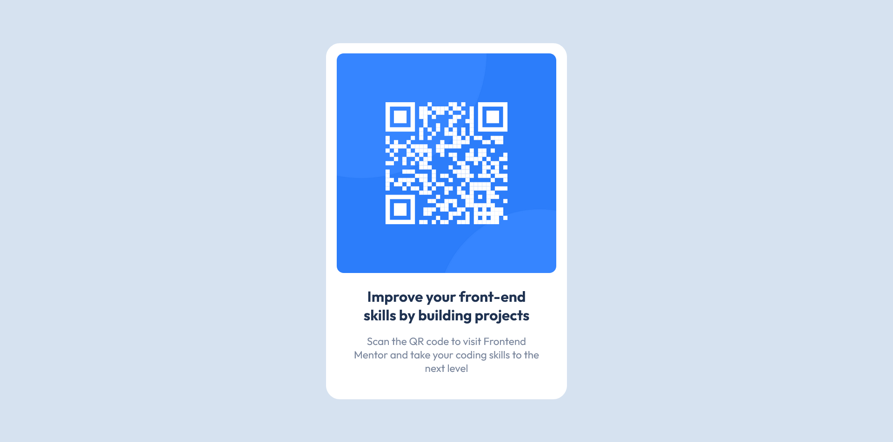

# Frontend Mentor - QR code component solution

This is a solution to the [QR code component challenge on Frontend Mentor](https://www.frontendmentor.io/challenges/qr-code-component-iux_sIO_H). Frontend Mentor challenges help you improve your coding skills by building realistic projects.

## Table of contents

- [Overview](#overview)
  - [Screenshot](#screenshot)
  - [Links](#links)
- [My process](#my-process)
  - [Built with](#built-with)
  - [What I learned](#what-i-learned)
  - [Useful resources](#useful-resources)

## Overview

### Screenshot



### Links

- Live Site URL: [click here](https://iulso.github.io/qrcode-component/)
- Solution URL in Frontend Mentor: [click here](https://www.frontendmentor.io/solutions/qr-code-component-d-qPqhhDOF)

## My process

### Built with

- Semantic HTML5 markup
- CSS custom properties
- Flexbox
- [BEM methodology](https://en.bem.info/methodology/)

### What I learned

With the main goal of building a reusable component, I decided to use CSS custom properties and the BEM methodology. This way, the code will still be valid even if the content changes and can be reused for other purposes.

I aligned the component within its container easily using flexbox:

```css
.content {
  display: flex;
  justify-content: center;
  align-items: center;
  height: 100vh;
}
```

### Useful resources

- [A Complete Guide to Flexbox](https://css-tricks.com/snippets/css/a-guide-to-flexbox/) - This is a comprehensive guide to CSS flexbox layout.
